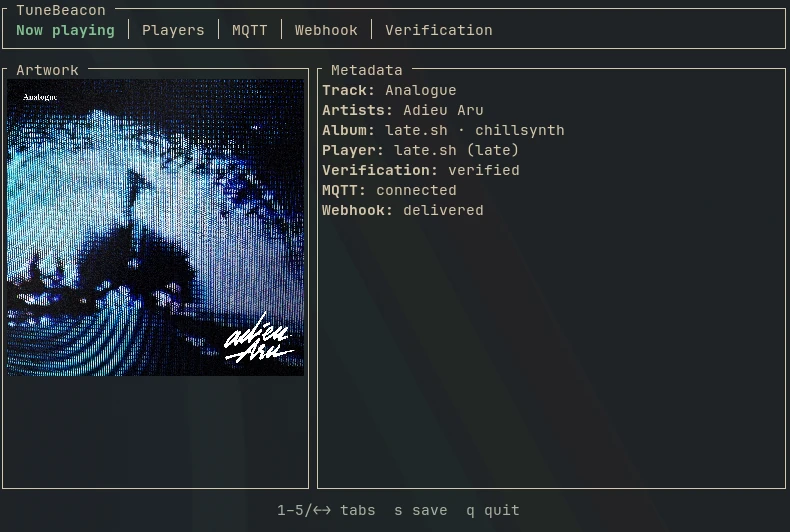

# TuneBeacon



TuneBeacon is a privacy-first Linux application that publishes verified “now
playing” metadata from explicitly approved MPRIS players to MQTT, HTTP
webhooks, or both.

It is a single Rust binary with two modes:

- `tunebeacon` opens the interactive terminal interface.
- `tunebeacon daemon` runs headless in the foreground for systemd or another
  supervisor.

TuneBeacon trusts no player by default. Its ordered allowlist starts empty, so
VLC, mpv, browsers, and every other MPRIS source remain private until you
explicitly allow one.

## Behaviour

- Only players whose stable key appears in the allowlist are considered.
- If several allowed players are playing, allowlist order decides priority.
- Pausing, stopping, or losing the selected player publishes nothing.
- Resuming publishes the track again with a fresh MPRIS observation timestamp.
- MusicBrainz verification is privacy-preserving by default. Unknown or
  unavailable matches are suppressed unless the unsafe fallback override is
  enabled.
- MQTT and webhooks are disabled by default. MQTT retain defaults to false and
  QoS defaults to 1.
- Local `file://` artwork is displayed locally but never appears in published
  JSON.

## Install

TuneBeacon requires a current stable Rust toolchain and a Linux desktop session
with D-Bus.

```console
cargo install --path .
tunebeacon
```

The application writes configuration to
`~/.config/tunebeacon/config.toml` using an atomic replacement and owner-only
permissions. Cached verification results and artwork live under
`~/.cache/tunebeacon` and are capped at 100 MiB.

The TUI keys are shown in context. The main controls are:

- `1`–`5` or arrow keys: switch views.
- Players: `Space` allows/denies; `Shift+Up/Down` changes priority.
- MQTT: `Up/Down` selects a field and `Enter` edits it; input supports normal
  cursor, Home/End, Delete/Backspace, and word movement. `e` enables MQTT,
  `l` toggles TLS, `o` changes QoS, `r` toggles retain, and `c` tests the
  connection.
- Webhook: `Up/Down` selects the URL or optional bearer token and `Enter` edits
  it. `e` enables webhook delivery and `c` sends a diagnostic test POST.
- Verification: `f` toggles marked fallback publishing.
- `s`: save configuration; `q`: quit.

MQTT passwords and webhook bearer tokens are masked in the interface. The
[example configuration](config.example.toml) documents every v1 setting.

## Daemon mode

Daemon mode refuses to start unless at least one output is enabled and every
enabled output is complete. MQTT requires its host, port, and topic; webhook
delivery requires an `http://` or `https://` URL:

```console
tunebeacon daemon
```

It does not fork. A sample user unit is available at
[`contrib/tunebeacon.service`](contrib/tunebeacon.service):

```console
mkdir -p ~/.config/systemd/user
cp contrib/tunebeacon.service ~/.config/systemd/user/
systemctl --user daemon-reload
systemctl --user enable --now tunebeacon
```

The daemon handles SIGINT and SIGTERM cleanly. Logs use `RUST_LOG`, for example
`RUST_LOG=tunebeacon=debug tunebeacon daemon`.

## Publication contract

MQTT messages and webhook POST bodies use the same JSON object. The default
MQTT topic is `tunebeacon/<hostname>/now-playing`. Webhook requests use
`Content-Type: application/json` and optionally
`Authorization: Bearer <token>`.

```json
{
  "schema_version": 1,
  "observed_at": "2026-07-27T10:15:30.123Z",
  "track": "Track title",
  "artists": ["Artist one", "Artist two"],
  "album": "Album title",
  "duration_ms": 245000,
  "art_url": "https://coverartarchive.org/release-group/...",
  "player": {
    "key": "spotify",
    "identity": "Spotify"
  },
  "verification": {
    "status": "verified",
    "score": 100,
    "recording_id": "musicbrainz-recording-uuid",
    "release_id": "musicbrainz-release-uuid",
    "release_group_id": "musicbrainz-release-group-uuid"
  }
}
```

`track`, `artists`, `album`, `observed_at`, `player`, and
`verification.status` are always present. Unknown optional fields are omitted.
Fallback statuses are `not_found`, `ambiguous`, and `unavailable`.
`observed_at` is when TuneBeacon read the metadata from MPRIS, not when
verification or delivery finished.

TuneBeacon deliberately publishes no tombstone on idle. If MQTT retain is
enabled, consumers must use `observed_at` to decide whether a retained message
is stale.

Webhook delivery accepts any 2xx response. Failed requests retry with a
1–60-second backoff, but only for the newest track that is still selected and
playing. A pause, stop, track change, or newer observation discards an obsolete
pending request. Redirects are not followed so bearer credentials cannot be
forwarded to another endpoint.

## Verification

TuneBeacon searches MusicBrainz no more than once per second with an identifiable
User-Agent. It accepts a candidate only when:

- its MusicBrainz score is at least 90;
- normalized titles match exactly;
- every reported MPRIS artist matches a credited artist.

Album and duration are ranking signals used to select useful enrichment IDs;
they are not publication gates. Multiple releases, remasters, or duplicate
recordings do not make a known title-and-artist pair ambiguous.

Successful verification is cached for 30 days; failures are cached for one
hour. Artwork prefers the MPRIS URL, then the Cover Art Archive release-group
front image. Kitty and Ghostty terminals use detected graphics support;
unsupported terminals use ratatui-image’s built-in half-block renderer, without
an external runtime image library.

## Development

```console
cargo fmt --all --check
cargo clippy --all-targets --all-features -- -D warnings
cargo test --all-targets --all-features
cargo build --release
```

The GitHub Actions workflow runs the same checks on Linux.
